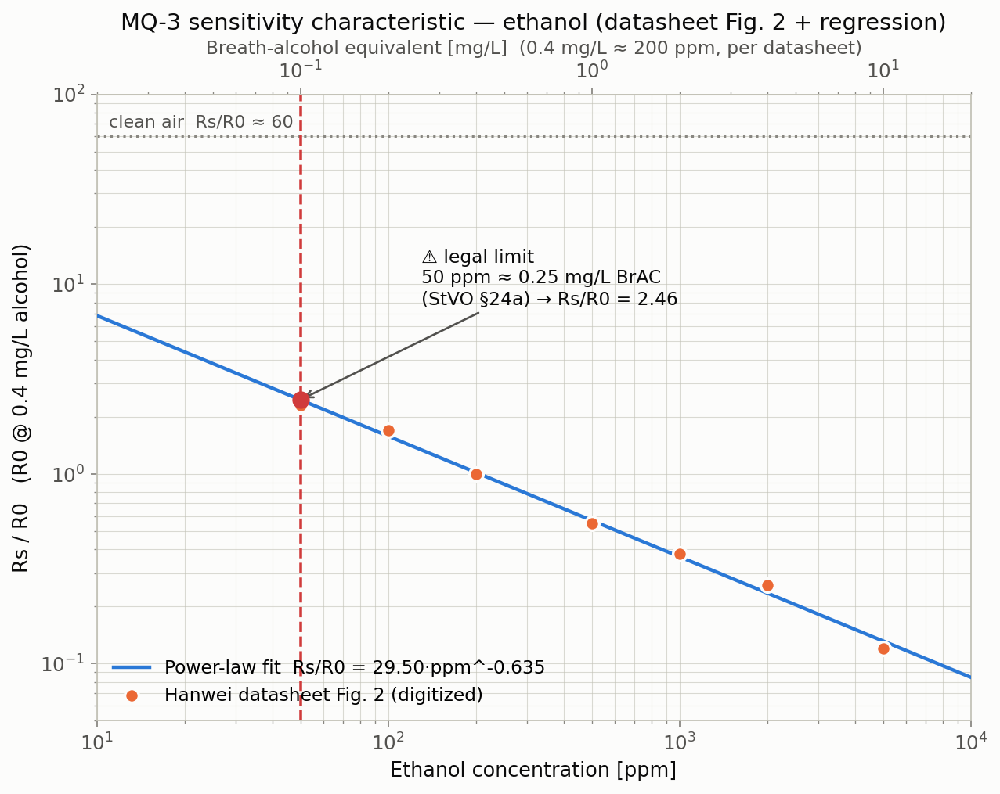
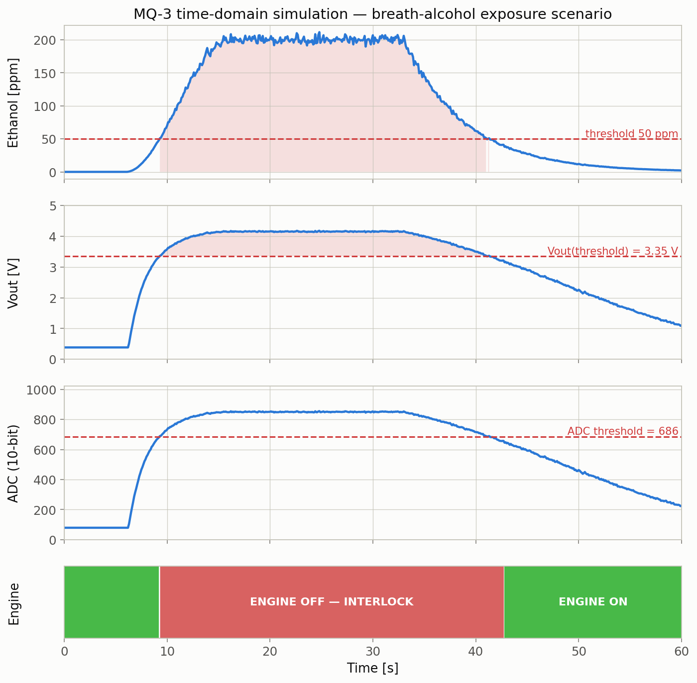
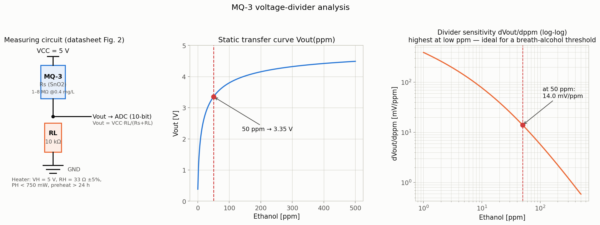
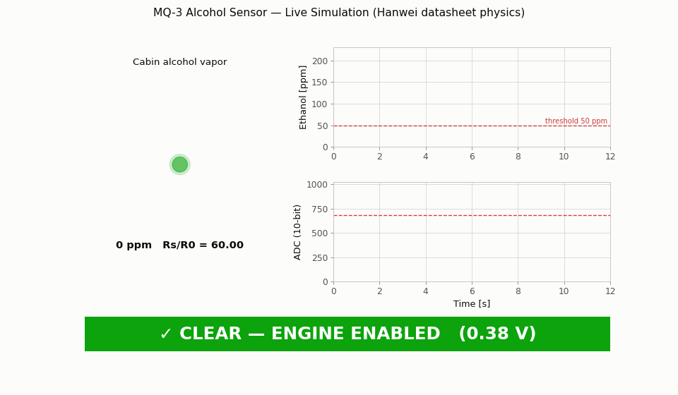

# Automotive Safety Sensor Simulation — MQ-3 Alcohol Sensor


A physics-accurate Python simulation of the **Hanwei Electronics MQ-3 alcohol gas
sensor** operating as the sensing element of an automotive **alcohol ignition
interlock** — the class of system that prevents a vehicle from starting when the
driver's breath alcohol exceeds the legal limit.

## Why this matters

Drunk driving remains one of the leading causes of traffic fatalities. Alcohol
ignition interlocks are mandated in several jurisdictions for repeat offenders,
and the EU General Safety Regulation (2019/2144) already requires all new cars to
provide a standardized *alcohol interlock installation facilitation* interface.
The MQ-3 — a tin-dioxide (SnO₂) metal-oxide-semiconductor (MOS) gas sensor — is
the classic low-cost sensing element used to prototype such systems. This project
simulates the complete measurement chain:

```
breath alcohol [ppm] → Rs (SnO₂ chemistry) → voltage divider → 10-bit ADC → threshold logic → engine interlock relay
```

The detection threshold defaults to **50 ppm ≈ 0.25 mg/L breath alcohol
concentration (BrAC)** — the German legal limit under **StVO §24a** (equivalent to
0.5 ‰ blood alcohol).

## Datasheet source — real data, not approximations

All sensor constants come from the manufacturer datasheet, fetched and digitized
for this project:

> Hanwei Electronics Co., Ltd., *"Technical Data — MQ-3 Gas Sensor"*,
> [https://www.sparkfun.com/datasheets/Sensors/MQ-3.pdf](https://www.sparkfun.com/datasheets/Sensors/MQ-3.pdf)

Values quoted directly from the document and used in the code:

| Parameter | Datasheet value | Used as |
|---|---|---|
| Circuit voltage $V_C$ | 5 V ± 0.1 | `VCC = 5.0` |
| Heater voltage $V_H$ | 5 V ± 0.1 | `V_HEATER = 5.0` |
| Heater resistance $R_H$ | 33 Ω ± 5 % | `R_HEATER = 33.0` |
| Heater power $P_H$ | < 750 mW | `P_HEATER_MAX = 0.750` |
| Sensing resistance $R_s$ | 1–8 MΩ @ 0.4 mg/L | schematic annotation / $R_0$ scaling note |
| Detection range | 0.05–10 mg/L alcohol | plot ranges |
| Preheat time | over 24 h | schematic annotation |
| Concentration slope $\alpha_{(0.4/1\,\text{mg/L})}$ | ≤ 0.6 | digitized curve gives 0.55 ✓ |
| Clean-air line (Fig. 2) | $R_s^{air}/R_0 \approx 60$ | `CLEAN_AIR_RATIO = 60` |
| mg/L ↔ ppm | 0.4 mg/L ≈ 200 ppm | `MG_L_TO_PPM = 500` |

The ethanol sensitivity curve of datasheet **Fig. 2** (log-log, 0.1–10 mg/L) was
digitized point by point and is plotted as scatter markers on top of the
regression in `results/mq3_sensitivity_curve.png`:

| mg/L | 0.1 | 0.2 | 0.4 | 1.0 | 2.0 | 4.0 | 10 |
|---|---|---|---|---|---|---|---|
| ppm | 50 | 100 | 200 | 500 | 1000 | 2000 | 5000 |
| $R_s/R_0$ | 2.3 | 1.7 | **1.0** | 0.55 | 0.38 | 0.26 | 0.12 |

## Sensor physics

**1. Power-law sensitivity (fitted with `scipy.optimize.curve_fit` to the digitized datasheet points):**

$$\frac{R_s}{R_0} = a \cdot \left(\text{ppm}\right)^{b}, \qquad a = 29.50,\; b = -0.635$$

clamped at the clean-air line $R_s/R_0 = 60$. $R_0$ is, per the datasheet, the
sensor resistance at 0.4 mg/L (≈ 200 ppm) alcohol — which is why the fit passes
through $R_s/R_0 = 1$ at 200 ppm.

> **Note on the widely quoted coefficients $a=0.3934$, $b=-1.504$:** they do *not*
> describe $R_s/R_0 = a\cdot\text{ppm}^b$ (that would give $R_s/R_0 \approx
> 10^{-4}$ at 200 ppm). They belong to the **inverse** regression
> $\text{mg/L} = 0.3934\cdot(R_s/R_0)^{-1.504}$. Our independent fit inverts to
> $\text{mg/L} \approx 0.411\cdot(R_s/R_0)^{-1.574}$ — consistent with the
> published coefficients and verified at runtime.

**2. Voltage divider (datasheet Fig. 2 measuring circuit):**

$$V_{out} = V_{CC}\cdot\frac{R_L}{R_s + R_L}$$

**3. ADC conversion (10-bit, Arduino-style):**

$$ADC = \left\lfloor V_{out}\cdot\frac{1023}{5.0} \right\rceil$$

**4. Interlock logic:** engine blocked when ppm ≥ threshold; re-arms with 20 %
hysteresis (below 0.8 × threshold) to prevent relay chatter.

**A note on $R_L$ and $R_0$:** the datasheet characterizes the bare sensor with
$R_L = 200\,\text{kΩ}$ and $R_s = 1\text{–}8\,\text{MΩ}$ @ 0.4 mg/L. This project
models an Arduino-style breakout with $R_L = 10\,\text{kΩ}$ (per the project
specification) and an effective calibrated $R_0 = 2\,\text{kΩ}$ — exactly what
trimpot calibration on a breakout module accomplishes — so the divider spans the
full 0–5 V ADC range. The dimensionless $R_s/R_0$ curve, which carries **all** of
the chemical sensitivity information, follows the datasheet unchanged.

## Installation

```bash
git clone <your-repo-url>/Automotive-Safety-Sensor-Sim.git
cd Automotive-Safety-Sensor-Sim
pip install -r requirements.txt
```

## Usage

**Static analysis + publication plots:**

```bash
python mq3_simulation.py
python mq3_simulation.py --ppm-peak 300 --duration 90 --threshold 50
python mq3_simulation.py --ppm-peak 120 --rise-time 5 --show
python mq3_simulation.py --output-dir results_hightest --ppm-peak 500
```

| Argument | Default | Meaning |
|---|---|---|
| `--ppm-peak` | 200 | Peak alcohol concentration [ppm] |
| `--duration` | 60 | Total simulation time [s] |
| `--threshold` | 50 | Detection threshold [ppm] |
| `--rise-time` | 10 | Concentration rise time [s] |
| `--output-dir` | `results/` | Plot output directory |
| `--show` | off | Also display plots interactively |

**Real-time animated dashboard (+ GIF export):**

```bash
python mq3_animated.py                 # live window, relay-click beep, saves GIF
MPLBACKEND=Agg python mq3_animated.py  # headless: GIF export only
```

Console output (serial-monitor style):

```
========================================
  MQ-3 ALCOHOL DETECTION SIMULATION
  Threshold: 50 ppm | Legal limit: 0.25 mg/L
========================================
[t=00.0s] PPM:   0.0 | Rs/R0: 60.00 | Vout: 0.38V | ADC:   79 | ✓ CLEAR
[t=12.0s] PPM: 126.9 | Rs/R0:  1.36 | Vout: 3.93V | ADC:  804 | ✗ ALCOHOL DETECTED
[t=60.0s] PPM:   2.2 | Rs/R0: 17.65 | Vout: 1.10V | ADC:  226 | ✓ CLEAR
========================================
  SUMMARY: Detected at t=9.3s | Duration: 32.0s
========================================
```

## Results

### 1 — Sensitivity characteristic (datasheet Fig. 2 + regression)

Log-log ethanol curve: digitized datasheet points, fitted power law, clean-air
line, legal-limit annotation, and a secondary mg/L axis.



### 2 — Time-domain simulation

Breath-alcohol exposure scenario through the full measurement chain: ppm → Vout →
ADC → engine-interlock state.



### 3 — Voltage-divider analysis

Measuring-circuit schematic (drawn with matplotlib patches), static transfer
curve, and divider sensitivity $dV_{out}/d\,\text{ppm}$.



### 4 — Live animation



## Simulation vs. real hardware

| Quantity | This simulation | Real MQ-3 hardware (datasheet / typical module) |
|---|---|---|
| Clean-air $R_s/R_0$ | 60.00 exactly | ≈ 60 (Fig. 2 air line); drifts with temp/humidity (Fig. 4: ±40 % over −10…50 °C) |
| $R_s/R_0$ @ 200 ppm | 1.00 (by definition of $R_0$) | 1.0, but $R_0$ itself spans 1–8 MΩ unit-to-unit |
| Response time | instantaneous (quasi-static model) | seconds-scale response, ~30 s+ recovery (SnO₂ desorption) |
| Preheat | ignored | > 24 h burn-in required for stable readings |
| Selectivity | ethanol only | responds weakly to benzine, LPG, hexane, CO (Fig. 2) |
| Noise | 2 % multiplicative, seeded | flicker + drift, humidity-dependent |
| ADC | ideal 10-bit, 5 V ref | INL/DNL, reference tolerance |
| Legal calibration | 50 ppm ≙ 0.25 mg/L threshold | certified interlocks use fuel-cell sensors; MOS sensors are prototype/pre-screen grade |

## Key engineering concepts

- **MOS gas sensing:** adsorbed O⁻ on the SnO₂ grain boundaries creates a
  depletion barrier; reducing gases (ethanol) release trapped electrons, lowering
  $R_s$ — hence resistance falls as concentration rises.
- **Log-log linearization:** MOS sensors obey a power law over decades of
  concentration, so calibration is a two-parameter line fit in log-log space.
- **Ratiometric design:** working with $R_s/R_0$ cancels unit-to-unit spread
  (1–8 MΩ!) and first-order temperature effects — the reason the datasheet
  publishes ratios, not resistances.
- **Load-resistor trade-off:** $R_L$ sets where the divider is most sensitive
  ($R_s \approx R_L$); the sensitivity plot shows dV/dppm is highest exactly in
  the low-ppm region where the legal threshold sits.
- **Threshold hysteresis:** the interlock re-arms only below 80 % of the trip
  point, the standard debouncing pattern for safety-relevant comparators.
- **Sensor-to-ADC signal chain:** concentration → resistance → voltage → digital
  count, the canonical embedded-systems measurement pipeline.

## Project structure

```
Automotive-Safety-Sensor-Sim/
├── README.md
├── requirements.txt
├── mq3_simulation.py     # physics core + CLI + 3 publication plots
├── mq3_animated.py       # FuncAnimation live dashboard + GIF export
└── results/
    ├── mq3_sensitivity_curve.png
    ├── mq3_time_simulation.png
    ├── mq3_voltage_divider_analysis.png
    └── mq3_animation.gif
```

## Author

**Dileep Rao Chilla**
Masters — Embedded & Autonomous Systems
Westsächsische Hochschule Zwickau

## License

MIT
